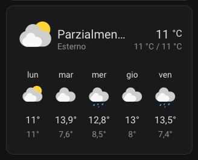
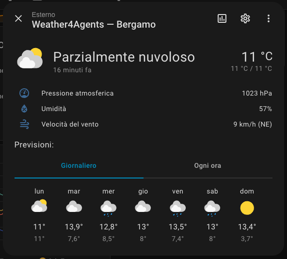
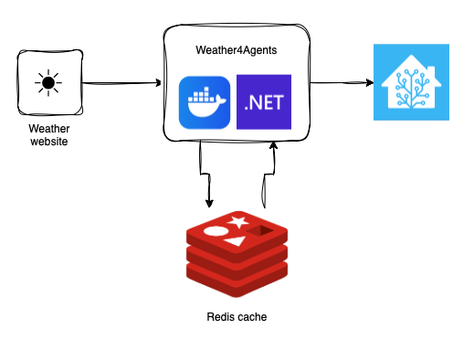
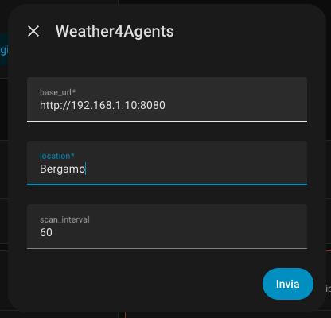

# Weather4Agents — Home Assistant integration

ℹ️ Custom integration for [Home Assistant](https://www.home-assistant.io/) that populates a native `weather` entity by consuming the Weather4Agents REST API.

<p align="center">
  
  &nbsp;&nbsp;
  
</p>

## Features

- Current weather conditions (temperature, humidity, pressure, wind)
- 7-day daily forecast (min/max temperature, condition, precipitation, wind)
- Hourly forecast for all available days
- Fully configured from the HA UI — no YAML required
- Local polling (`iot_class: local_polling`) — works without internet access

## Workflow



## Requirements

- Home Assistant 2023.9 or newer
- Weather4Agents API running and reachable from the HA container

## Installation

1. Copy the `custom_components/weather4agents/` folder into your Home Assistant configuration directory:

   ```
   <ha_config>/custom_components/weather4agents/
   ```

   Typical locations:
   - `/config/custom_components/weather4agents/` (HA OS / Supervised)
   - `~/.homeassistant/custom_components/weather4agents/` (docker / manual install)

2. Restart Home Assistant.

3. Go to **Settings → Integrations → Add Integration** and search for **Weather4Agents**.


4. Fill in the configuration form:

   | Field | Description | Example |
   |-------|-------------|---------|
   | API Base URL | Full URL of the Weather4Agents API | `http://192.168.1.10:8080` |
   | Location | City name configured in the API | `bergamo` |
   | Update interval | Refresh frequency in minutes (5–1440) | `60` |



5. Click **Submit**.

## Docker networking note

If both HA and Weather4Agents run as Docker containers on the same host, use the **host IP address** (or the Docker bridge network IP) in the Base URL field — not `localhost`, which resolves inside the HA container itself.

Example using the host IP:
```
http://192.168.1.10:8080
```

If they share a custom Docker network, you can also use the container name:
```
http://weather4agents:8080
```

## Lovelace card

Add a weather forecast card to any dashboard:

```yaml
type: weather-forecast
entity: weather.weather4agents_nembro
forecast_type: daily   # or "hourly"
```

## Uninstall

Go to **Settings → Integrations**, find the Weather4Agents entry and click **Delete**.
Then remove the `custom_components/weather4agents/` folder and restart HA.
