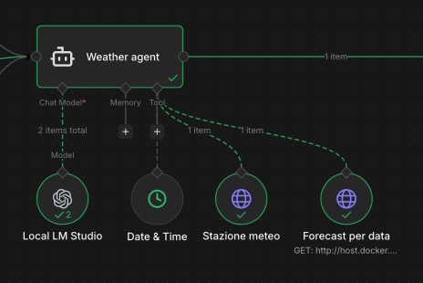

# Weather4Agents 🤖
Tool developed to scrape weather data from your favourite weather website.

I use this tool to display data in **Home Assistant** and to quickly provide weather data to my agents (e.g. 🦞 **OpenClaw** or n8n), without consuming too many tokens.
For this second purpose, I generate JSON files with weather data, so that my agents know where to retrieve the information.

## Features
- **REST API** — multi-day forecast and single-day weather, with support for multiple providers. Scalar UI available at `<endpoint>/scalar/v1`
- **File system storage** — Saves the forecast to JSON files on the file system, see [dedicated section](docs/job.md).

## Getting started
1. Copy the .env.template file to .env
2. Start the docker compose with the command:
    ```bash
    docker-compose up -d
    ```
Configurable parameters (.env)

| Environment variable | Default | Description |
|---|---|---|
| `WeatherScraping__DefaultProvider` | — | Default provider (e.g. `3bMeteo`) |
| `WeatherScraping__EnabledProviders__0` | — | List of enabled providers (e.g. `3bMeteo`) |
| `WeatherScraping__Locations__0` | — | List of locations to monitor (e.g. `Bergamo`).  |
| `WeatherScraping__JobIntervalMinutes` | `60` | Scraping job interval in minutes |
| `WeatherFileStorage__Enabled` | `false` | Enable/disable the file storage job |
| `WeatherFileStorage__OutputPath` | `weather-data` | Root directory where JSON files are written |
| `WeatherFileStorage__JobIntervalMinutes` | `60` | File storage job interval in minutes |
| `WeatherFileStorage__CleanupEnabled` | `false` | If `true`, deletes JSON files older than yesterday on each cycle |
> ℹ️ See [the documentation](docs/docker.md) for further details on Docker
## Available providers:
| Provider | Name | Status |
|---|---|---|
| [3bMeteo](https://www.3bmeteo.com) | `3bMeteo` | ✅ Implemented |
## Scheduled jobs
[See the documentation here](docs/jobs.md)

# Integrations
## Home assistant
It's possible to integrate weather forecast into home assistant (as native weather entity) using custom integration. [Here you can find instructions](/Integrations/HomeAssistant/README.md) about integration.

## 🦞 OpenClaw
You can use json file on filesystem (generated by the feature _File system storage_) as source file (this avoid to waste tokens in web page scraping).

Alternatively you can use APIs

## n8n
Yu can consume APIs to get weather data



# Changelog
## v1.0.5
- Updated 3bmeteo web scraper (3bmeteo website was updated)
## v1.0.4
- Updated 3bmeteo web scraper (3bmeteo website was refactored)
## v1.0.3
- OpenApi definitions in `<endpoint>/openapi/v1.json`
- Refactoring of api endpoints definitions
## v1.0.2
- Fixed bug with mapping of word "velature sparse" (3bmeteo)
- Custom integration for Home Assistant (Integrations/HomeAssistant)
## v1.0.1
- Removed Mediatr dependency and implemented a base service to handle CQRS pattern
- Improved appsettings loading for development mode
- Docker image for arm64 (raspberry) and amd64
- New endpoint to get 7 days forecast
## v1.0.0
- Initial release

