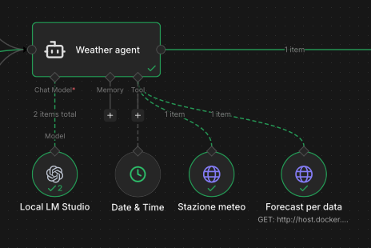

# Weather4Agents 🤖
Tool developed to scrape weather data from your favourite weather website.

I use this tool to display data in **Home Assistant** and to quickly provide weather data to my agents (e.g. 🦞 **OpenClaw** or n8n), without consuming too many tokens.
For this second purpose, I generate JSON files with weather data, so that my agents know where to retrieve the information.

## Features
- **REST API** — multi-day forecast and single-day weather, with support for multiple providers. Scalar UI available at `<endpoint>/scalar/v1`. The full contract is documented in [docs/api.md](docs/api.md).
- **File system storage** — Saves the forecast to JSON files on the file system, see [dedicated section](docs/jobs.md).

## Getting started
The Docker assets live in the [`docker/`](docker/) directory.
1. From the `docker/` directory, copy the template to `.env`:
    ```bash
    cd docker
    cp .env.template .env
    ```
2. Start the stack (still from `docker/`):
    ```bash
    docker compose up -d
    ```
> ℹ️ **Windows users:** the compose file mounts the forecast output with the relative host path
> `./weather-data:/app/weather-data`, which works on Linux/macOS out of the box. If you prefer a
> fixed Windows location, replace it with an absolute path in `docker/docker-compose.yml`, e.g.
> `C:\WeatherData:/app/weather-data`.

Configurable parameters (`docker/.env`)

| Environment variable | Default | Description |
|---|---|---|
| `WeatherScraping__DefaultProvider` | `3bMeteo` | Default provider used when a request omits one |
| `WeatherScraping__EnabledProviders__0` | `3bMeteo` | List of enabled providers (must include the default) |
| `WeatherScraping__Locations__0` | `Bergamo` | List of locations to scrape on the schedule |
| `WeatherScraping__AllowUnconfiguredLocations` | `true` | If `false`, only the configured `Locations` are servable (others get `403`) |
| `WeatherScraping__JobIntervalMinutes` | `60` | Scraping cycle interval in minutes (1–1440) |
| `WeatherScraping__HttpTimeoutSeconds` | `15` | Per-attempt HTTP timeout for provider fetches (1–60) |
| `WeatherScraping__TodayCacheMinutes` | `30` | Cache TTL for the current day's forecast in minutes (1–1440) |
| `WeatherScraping__ExtendedCacheHours` | `6` | Cache TTL for the following days' forecast in hours (1–168) |
| `WeatherScraping__NegativeCacheMinutes` | `5` | Cache TTL for an empty scrape (unknown/unreachable location) in minutes (1–60) |
| `WeatherFileStorage__Enabled` | `false` | Enable/disable writing forecasts to JSON files |
| `WeatherFileStorage__OutputPath` | `weather-data` | Root directory where JSON files are written |
| `WeatherFileStorage__CleanupEnabled` | `false` | If `true`, deletes JSON files older than yesterday on each cycle |
| `RateLimiting__Enabled` | `true` | Enable per-IP fixed-window rate limiting on the weather endpoints |
| `RateLimiting__PermitLimit` | `100` | Requests allowed per window, per client IP |
| `RateLimiting__WindowSeconds` | `60` | Rate-limit window length in seconds |
| `RateLimiting__QueueLimit` | `0` | Requests queued once the limit is hit (0 = reject immediately) |
| `HealthCheck__MaxScrapeAgeMinutes` | `120` | `/health` is unhealthy if the last successful scrape is older than this |

> ℹ️ File storage is written as the final step of the scraping cycle — there is no separate storage
> schedule. See [docs/jobs.md](docs/jobs.md) for the job model and [docs/docker.md](docs/docker.md)
> for more Docker details.
## Configuration and secrets
Environment-specific settings are loaded through the standard ASP.NET Core mechanism
(`appsettings.{Environment}.json`, selected by `ASPNETCORE_ENVIRONMENT`).

**Never put secrets (passwords, tokens, API keys) in `appsettings*.json` files**: they are
committed to a public repository. Use instead:
- **Development**: [User Secrets](https://learn.microsoft.com/aspnet/core/security/app-secrets)
  — the API project already has a `UserSecretsId`, so `dotnet user-secrets set "Key" "value" --project Weather4Agents.API` works out of the box
- **Production / Docker**: environment variables (e.g. `Section__Key=value` in `.env`)

Any secret that ends up in a commit must be considered compromised and rotated immediately,
even if the file is later removed or gitignored.
## Available providers:
| Provider | Name | Status |
|---|---|---|
| [3bMeteo](https://www.3bmeteo.com) | `3bMeteo` | ✅ Implemented |

> ⚠️ Data is obtained by scraping the provider's public pages. Please read
> [docs/scraping.md](docs/scraping.md) for the responsible-use guidance (User-Agent, robots/ToS,
> recommended minimum scraping interval) before deploying.
## Scheduled jobs
[See the documentation here](docs/jobs.md)

# Integrations
## Home assistant
It's possible to integrate weather forecast into home assistant (as native weather entity) using custom integration. [Here you can find instructions](/Integrations/HomeAssistant/README.md) about integration.

## 🦞 OpenClaw
You can use json file on filesystem (generated by the feature _File system storage_) as source file (this avoid to waste tokens in web page scraping).

Alternatively you can use APIs

## n8n
You can consume the APIs to get weather data.



# Changelog
See [CHANGELOG.md](CHANGELOG.md) for the full version history.

